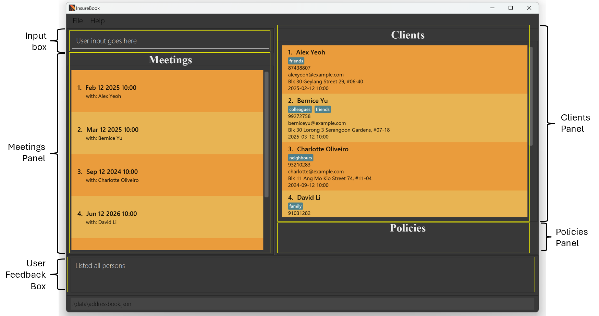
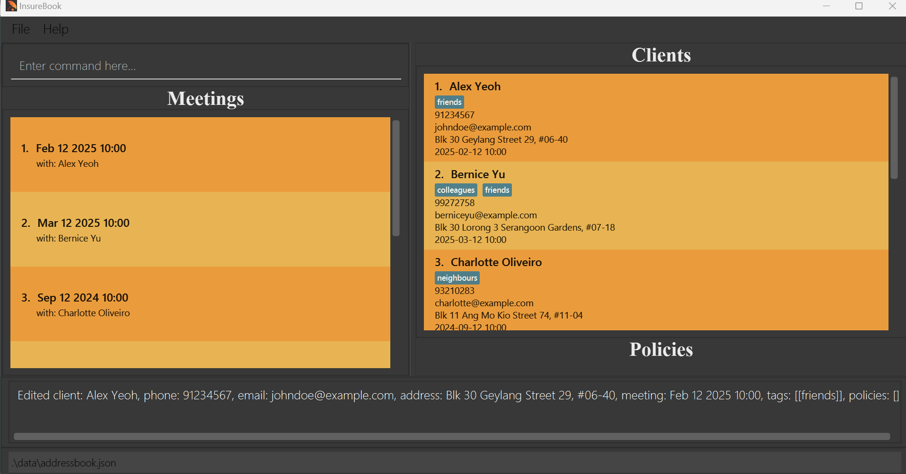
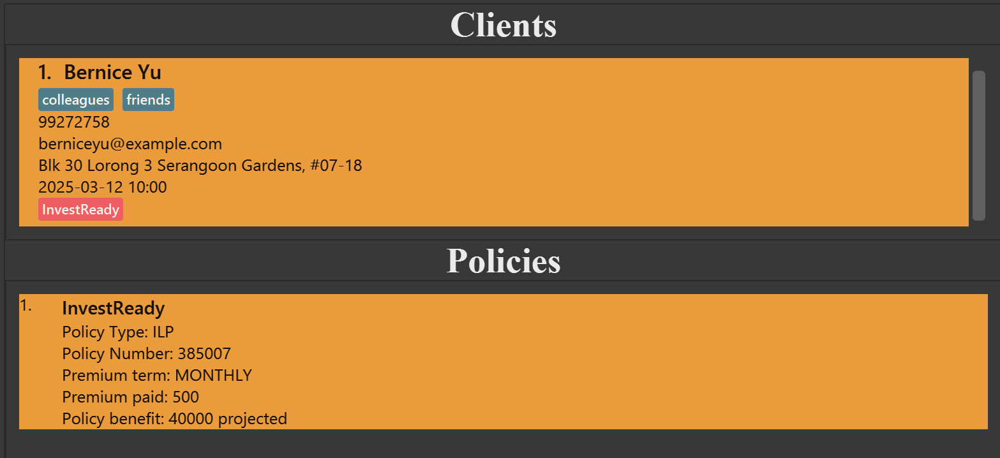
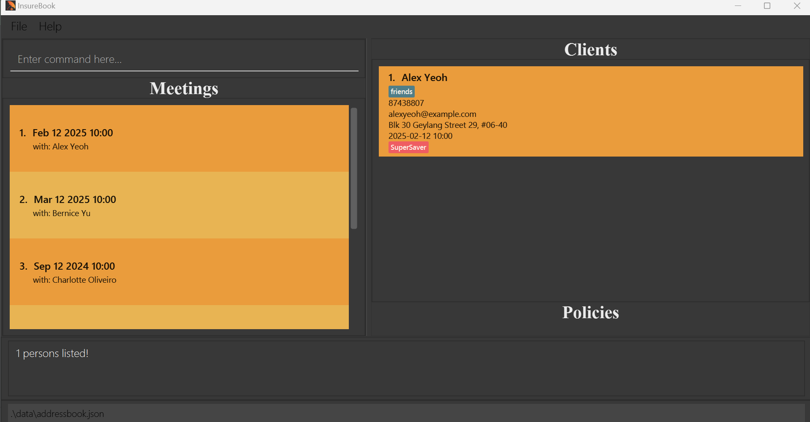
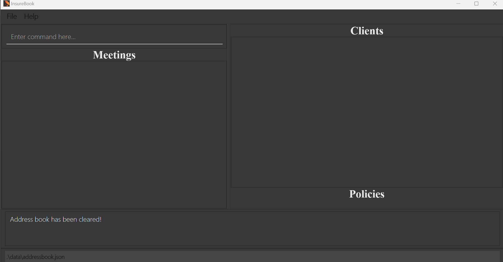

---

layout: default.md

title: "User Guide"

pageNav: 3

---

# InsureBook User Guide

InsureBook is a **desktop app for insurance agents to manage potential and existing clients' personal and policy details.** The app has a Graphical User Interface (GUI), but most user interactions occur via a Command Line Interface (CLI). If you can type fast, InsureBook can get your client management tasks done faster than traditional GUI apps!

 - [Quick Start](#quick-start)
 - [Features](#features)
	- [Viewing help : `help`](#finding-help-help)
	- [Adding a client : `add`](#adding-a-client-add)
	- [Listing all clients : `list`](#listing-all-clients-list)
	- [Editing a client : `edit`](#editing-a-client-edit)
	- [Locating clients by name : `find`](#locating-clients-by-name-find)
	- [Deleting a client : `delete`](#deleting-a-client-delete)
	- [View a client's complete profile : `view`](#view-a-client-s-complete-profile-view)
	- [Adding a new policy to a client : `addPolicy`](#adding-a-new-policy-to-a-client-addpolicy)
	- [Deleting an existing policy from a client : `delPolicy`](#deleting-an-existing-policy-from-a-client-delpolicy)
	- [Locating clients via Policy Name: `findPolicy`](#locating-clients-via-policy-name-findpolicy)
	- [View the lists of meetings for this week : `meetings`](#view-the-lists-of-meetings-for-this-week-meetings)
	- [Clearing all client entries : `clear`](#clearing-all-client-entries-clear)
	- [Exiting InsureBook : `exit`](#exiting-insurebook-exit)
	- [Saving data in InsureBook](#saving-data-in-insurebook)
- [FAQ](#faq)
- [Known Issues](#known-issues)
- [Command Summary](#command-summary)

<page-nav-print  />

--------------------------------------------------------------------------------------------------------------------

## Quick start

1. Ensure you have Java `11` or above installed in your Computer. 
   If your computer is not running Java version `11` or above, you may download it from [here](https://www.oracle.com/java/technologies/downloads/#java11).
2. Download the latest `InsureBook.jar` from [here](https://github.com/AY2324S2-CS2103T-W09-4/tp/releases).
3. Copy the file to the folder you want to use as the _home folder_ for InsureBook.
4. Open a command terminal and `cd` into the folder you put the jar file in. Alternatively,  
   **[Windows 11]** right-click anywhere in the display pane's background, then click "Open in Terminal":

   

   **[macOS]** right-click on the _home folder_ and click "New Terminal at Folder":

   

	**[Linux]** this depends on the environment and file manager. Look for any buttons similar to the ones shown above, e.g. "Open in Terminal" or "Open Terminal Here".  
    If you **can't find** any of these buttons (e.g. using a different OS), and can't find similar buttons, we recommend using `cd` to navigate to this folder.
     
   
5. Type `java -jar insurebook.jar` to run the application. 
   A GUI similar to the one below should appear on screen. Note that the app contains some pre-loaded sample data. 
       

   Labelling each component of the UI:
     

   | Component         | Explanation                                                         |
   |-------------------|---------------------------------------------------------------------|
   | Input Box         | This is where you key in inputs                                     |
   | User Feedback Box | After entering an input, feedback will be shown to you here         |
   | Meetings Panel    | Displays* all meeting dates and times, along with the client's name |
   | Clients Panel     | Displays clients' details (Name, phone number, etc.)                |
   | Policies Panel    | Displays the selected client's policies details (when using `view`) |

	 
	

	📝 <strong>Note:</strong>
	The Meetings panel displays meetings in the same order as the Clients panel in <code>list</code> view, and is NOT sorted chronologically.
	
  

6. Type your command into the user input box and press Enter to execute it. e.g. type **`help`** and press Enter to open the help window. 
Some example commands you can try:

*  `list` : Lists all clients.

*  `add n/John Doe p/98765432 e/johnd@example.com a/123 John Street m/2024-08-02 10:00` : Adds a contact named `John Doe` to your InsureBook.

*  `delete 3` : Deletes the 3rd client shown in the current list.

*  `clear` : Deletes all clients.

*  `exit` : Exits the app.

7. Refer to the [Features](#features) below for details of each command.

 

&#x1F4A1; <strong>Tip:</strong>
For the best experience, use InsureBook in full-screen!

--------------------------------------------------------------------------------------------------------------------

## Features

<box  type="info"  seamless>

**Notes about the command format:** 

* Commands are case-sensitive.

e.g. `add` is a valid command but `Add` will not be a valid command.

* Words in `UPPER_CASE` are the parameters to be supplied by the user. 

e.g. in `add n/NAME`, `NAME` is a parameter which can be used as `add n/John Doe`.

* Items in square brackets are optional. 

e.g `n/NAME [t/TAG]` can be used as `n/John Doe t/friend` or as `n/John Doe`.

* Items with `…`​ after them can be used multiple times including zero times. 

e.g. `[t/TAG]…​` can be used as ` ` (i.e. 0 times), `t/friend`, `t/friend t/family` etc.

* Parameters can be in any order. 

e.g. if the command specifies `n/NAME p/PHONE_NUMBER`, `p/PHONE_NUMBER n/NAME` is also acceptable.

* Extraneous parameters for commands that do not take in parameters (such as `help`, `list`, `exit` and `clear`)
will be ignored. 

e.g. if the command specifies `help 123`, it will be interpreted as `help`.

* If you are using a PDF version of this document, be careful when copying and pasting commands that span
multiple lines as space characters surrounding line-breaks may be omitted when copied over to the application.

</box>

## Commands

### Finding help : `help`

Opens a pop-up window with the link to InsureBook's User Guide and Command Summary for your reference.
The link can be copied by using the 'Enter' key, and the window can be closed using the 'Esc' key.
	   
Format: `help`

### Adding a client : `add`

Adds a client, together with their name, phone number, email, address and meeting date and time into InsureBook.  
You may also add optional tags to the client, to provide any extra details as labels.
	   
Format: `add n/NAME p/PHONE_NUMBER e/EMAIL a/ADDRESS m/MEETING_DATE MEETING_TIME [t/TAG]...`

 

📝 <strong>Note:</strong>

PHONE_NUMBER does not need to be unique across different clients.

EMAIL does not need to be unique across different clients.

ADDRESS does not need to be unique across different clients.

 

&#x2757; <strong>Caution:</strong>

Meeting field input <strong>MUST</strong> be a date and time in the future!

MEETING_TIME <strong>MUST</strong> be unique!

Name <strong>MUST</strong> be alphanumeric characters only!

PHONE_NUMBER <strong>MUST</strong> be numeric characters only! <strong> Min: 3 characters</strong>

 

&#x1F4A1; <strong>Tip:</strong>
It is optional for the client to have tags. A client can have any number of tags (including 0). TAG <strong>MUST</strong> be alphanumeric characters only!

 

Examples:

*  `add n/Jenny Chen p/91234567 e/jenjenc@gmail.com a/688, Yio Chu Kang Ave 5, #04-25 m/2024-10-12 14:00`

*  `add n/John Doe p/98765432 e/johnd@example.com a/311, Clementi Ave 2, #02-25 m/2024-07-12 12:00 t/friends`

*  `add n/Jack Daniel p/91118932 e/jackys@hotmail.com a/291, Woodlands Dr 89, #08-56 m/2025-02-20 10:00 t/acquaintence t/schoolmate`

### Listing all clients : `list`

Shows a list of all clients in InsureBook.
	   
Format: `list`

### Editing a client : `edit`

Edits an existing client in InsureBook.
	   
Format: `edit INDEX [n/NAME] [p/PHONE_NUMBER] [e/EMAIL] [a/ADDRESS] [m/MEETING_DATE MEETING_TIME] [t/TAG]...`

* Edits the client at the specified INDEX. The index refers to the index number shown in the displayed client list.
The index must be a positive integer 1, 2, 3, …​

* At least one of the [optional] fields must be provided.

* Existing values will be updated to the input values.

* When editing tags, the existing tags of the client will be removed i.e adding of tags is not cumulative.

* You can remove all the client’s tags by typing t/ without specifying any tags after it.

 

📝 <strong>Note:</strong>

PHONE_NUMBER does not need to be unique.

EMAIL does not need to be unique.

ADDRESS does not need to be unique.

 

&#x2757; <strong>Caution:</strong>

Meeting field input <strong>MUST</strong> be a date and time in the future!

MEETING_TIME <strong>MUST</strong> be unique!

Name <strong>MUST</strong> be alphanumeric characters only!

PHONE_NUMBER <strong>MUST</strong> be numeric characters only! <strong> Min: 3 characters</strong>

 

Examples:

*  `edit 1 p/91234567 e/johndoe@example.com` Edits the phone number and email address of the 1st client to
be `91234567` and `johndoe@example.com` respectively.

*  `edit 2 n/Jinny Tan t/friends` Edits the name of the 2nd client to be `Jinny Tan` and overrides existing tags
with the `friends` tag.

*  `edit 4 n/Betsy Crower t/` Edits the name of the 4th client to be `Betsy Crower` and clears all existing tags.

### Locating clients by name : `find`

Finds clients whose names contain any of the input keywords.
	   
Format: `find KEYWORD [MORE_KEYWORDS]`

* The search is case-insensitive. e.g `hans` will match `Hans`

* The order of the keywords does not matter. e.g. `Hans Bo` will match `Bo Hans`

* Only the name is searched.

* Both full and partial words will be matched e.g. `Han` will match `Hans`

* Clients matching at least one keyword will be returned (i.e. `OR` search). e.g. `Hans Bo` will return `Hans Gruber`, `Bo Yang`

Examples:

`find Joh` returns `Johnny Daniels` and `John Doe`

`find alex david` returns `Alex Yeoh`, `David Li`

### Deleting a client : `delete`

Removes an existing client based on their index from InsureBook.
	   
Format: `delete INDEX`

* Deletes the client at the specified `INDEX`.
* The index refers to the index number shown in the displayed client list.
  The index must be a positive integer 1, 2, 3, …​

📝 <strong>Note:</strong>
The index must be an integer in the displayed client list.

 

Examples:

*  `list` followed by `delete 2` deletes the 2nd client displayed in InsureBook.

*  `find Betsy` followed by `delete 1` deletes the 1st client in the results of the find command.

### View a client's complete profile : `view`

Expands a client's profile such that the user can see all policies and policy details.

The policies panel will expand upon calling the `view` function:
	   
Format: `view INDEX`

* Views the client's policies at the specified `INDEX`.
* The index refers to the index number shown in the displayed client list.
  The index must be a positive integer 1, 2, 3, …​

📝 <strong>Note:</strong>
The index must be an integer in the displayed client list.

 

Examples:

*  `view 1` will show all policies and policy details of the 1st client displayed in InsureBook.

*  `find Bern` followed by `view 2` will show all policies and policy details of the 2nd client in
the results of the find command.

### Adding a new policy to a client : `addPolicy`

Adds a new insurance policy to a specific client.
	   
Format: `addPolicy INDEX pol/POLICY_NAME type/POLICY_TYPE polnum/POLICY_NUMBER
pterm/PREMIUM_TERM prem/POLICY_PREMIUM b/BENEFIT`

* Adds a policy to the person at the specified `INDEX`.

* The index refers to the index number shown in the displayed client list.
  The index must be a positive integer 1, 2, 3, …​

📝 <strong>Note:</strong>
The index must be an integer in the displayed client list.

 

*  `POLICY_NAME` is the name of the policy to be added.

&#x1F4A1; <strong>Tip:</strong>
POLICY_NAME can contain non-alphanumeric characters.

 
*  `POLICY_TYPE` is the type of policy to be added. (e.g. "Health", "Car", "Life")

&#x2757; <strong>Caution:</strong>
POLICY_TYPE MUST be alphanumeric characters only!

 

*  `POLICY_NUMBER` is the policy number of the policy and must not be repeated in the person's current list
of policies. (e.g. "123456", "123-abc-xyz")

&#x1F4A1; <strong>Tip:</strong>
POLICY_NUMBER can contain non-alphanumeric characters.

 

*  `PREMIUM_TERM` is the premium term of the policy. The premium term of the policy can only be one of the
following options (case insensitive):

	**["Single", "Monthly", "Quarterly", "Semi-annually", "Annually"]**

 

*  `POLICY_PREMIUM` is the premium of the policy. You may use alphanumeric characters for the abbreviation of
large numbers or to indicate non-cash payment methods. (e.g. "100mil", "500 CPF OA")

&#x2757; <strong>Caution:</strong>
POLICY_PREMIUM MUST be alphanumeric characters only!

 
*  `BENEFIT` is the policy's benefit (e.g. sum assured). You may use alphanumeric characters for the abbreviation of
large numbers. (e.g. "100mil", "100M")

&#x2757; <strong>Caution:</strong>
BENEFIT MUST be alphanumeric characters only!

 

Examples:

*  `addPolicy 1 pol/SuperSaver type/CI polnum/39376234 pterm/Annually prem/3000 b/100000`

### Deleting an existing policy from a client : `delPolicy`

Deletes an existing insurance policy of a specific client.
	   
Format: `delPolicy INDEX polnum/POLICY_NUMBER`

* Deletes a policy to the person at the specified `INDEX`.
* The index refers to the index number shown in the displayed client list.
  The index must be a positive integer 1, 2, 3, …​

📝 <strong>Note:</strong>
The index must be an integer in the displayed client list.

 

* POLICY_NUMBER must be an existing policy number tied to the Client at specified `INDEX`.

&#x1F4A1; <strong>Tip:</strong>
POLICY_NUMBER can contain non-alphanumeric characters.

 

Examples:

 - `delPolicy 1 polnum/39376234` will delete the existing policy with policy number 39376234 from the Client at `INDEX` 1.
 - `delPolicy 2 polnum/1111111A`  will delete the existing policy with policy number 1111111A from the Client at `INDEX` 2.

### Locating clients via Policy Name : `findPolicy`

Finds the specified policy for all clients
	   
Format: `findPolicy POLICY_NAME`

* Finds clients with the specified `POLICY_NAME`.

* `POLICY_NAME` is the part of the policy you are searching for.

    &#x1F4A1; <strong>Tip:</strong>
    It does not need to be an exact match to the full policy name.

 

Examples:
* `findPolicy SuperSaver`
* `findPolicy Super`
* `findPolicy S`

### View the lists of meetings for this week : `meetings`

Opens a new window containing a list of all meetings for _**this week**_, in chronological order.  

Meetings are considered to be scheduled for the current week if they are within the same Monday to Sunday block:  

e.g. If today is Tuesday (2nd April), then meetings scheduled from Monday (1st April) to Sunday (7th April) will be displayed.

 

Meetings will be displayed as: "Number | < Meeting Date & Time > with: < Client Name >".
The meetings window can be **closed** by simply **pressing 'Esc'** on your keyboard.

 

📝 <strong>Note:</strong>
The Meetings window is static, i.e. will not be updated when you add a new meeting. You will need to use the 'meetings' command again.

 

Format: `meetings`

### Clearing all client entries : `clear`

Clears all client entries from InsureBook.
	   
Format:`clear`

### Exiting InsureBook : `exit`

Exits Insurebook and closes the application window.

Format:`exit`

#### Saving data in InsureBook

AddressBook data are saved in the hard disk automatically after any command that changes the data. There is no need to save manually.

--------------------------------------------------------------------------------------------------------------------

## FAQ

**Q**: How do I transfer my data to another Computer? 
**A**: Install the app in the other computer and overwrite the empty data file it creates with the file that contains the data of your previous InsureBook home folder.

**Q**: What if I have two clients with the same name? 
**A**: You are not allowed to add clients with duplicate names into InsureBook. If you have more than 1 client with the same name, consider adding a unique identifier to their names, e.g. 'John Doe from NUS' and 'John Doe from SMU'.

**Q**: My client's name contains special characters, but the Name field must be alphanumeric only. How do I workaround this?
**A**: For now, you may use a space character for such scenarios, e.g. `"s o"` instead of `"s/o"`. We will allow some special characters in future versions of InsureBook.

**Q**: Can I leave the meeting field empty for clients that I have not scheduled a meeting with? 
**A**: No - the meeting field is mandatory. You WILL need to schedule appointments with your clients before adding them to the address book. We believe that requiring you to be proactive in scheduling appointments will help you reach greater heights in your career!

**Q**: How can I edit my client's current policy details? I typed some fields wrongly.
**A**: You may delete the policy with `delPolicy` and add the correct version with `addPolicy`.

--------------------------------------------------------------------------------------------------------------------

## Known issues

1.  **When using multiple screens**, if you move the application to a secondary screen, and later switch to using
only the primary screen, the GUI will open off-screen. The remedy is to delete the `preferences.json` file created
by the application before running the application again.
2. Phone number field is allowed to be a nonsensical number, e.g. "123". Please **ensure you type in your client's phone number carefully** to avoid recording down an incorrect number. Future versions will check the phone number field to make your workflow less error-prone.
3. Phone number field is allowed to have any amount of digits. However, if the number exceeds a certain amount, the application window will cut off the numbers that exceed the window size. Please ensure that your phone numbers added are logical within the size of the window.
4. Phone number and email are all not unique, i.e. two clients can have the same phone number. Address is non-unique too, but this is intended as you may have clients living together.  
   Again, please **ensure you type in your client's details carefully** to prevent the situation of clients having duplicate phone numbers or email addresses.
4. If the entered policy name exceeds a certain amount of characters, the application window would cut off the characters that are out of the frame in the policy tag. 
To view the policy name in full, please use the view command to look at the policy details in full and the full policy name will be displayed.

--------------------------------------------------------------------------------------------------------------------

## Command summary
| Action                           | Format, Examples                                                                                                                                                                                                             |
|----------------------------------|------------------------------------------------------------------------------------------------------------------------------------------------------------------------------------------------------------------------------|
| **Find help**                    | `help`                                                                                                                                                                                                                       |
| **Add client**                   | `add n/NAME p/PHONE_NUMBER e/EMAIL a/ADDRESS m/MEETING_DATE MEETING_TIME [t/TAG]…​`   e.g., `add n/James Ho p/91112222 e/jamesho@example.com a/123 Clementi Rd, S(123456) m/2025-02-20 10:00 t/single t/student`          |
| **List all clients**             | `list`                                                                                                                                                                                                                       |
| **Edit client**                  | `edit INDEX [n/NAME] [p/PHONE_NUMBER] [e/EMAIL] [a/ADDRESS] [m/MEETING_DATE MEETING_TIME] [t/TAG]…​`  e.g.,`edit 2 n/James Lee e/jameslee@example.com`                                                                    |
| **Find client(s) using name**    | `find KEYWORD [MORE_KEYWORDS]`  e.g., `find James Jake`                                                                                                                                                                   |
| **Delete client**                | `delete INDEX`  e.g., `delete 3`                                                                                                                                                                                        ` |
| **View client profile**          | `view INDEX`  e.g., `view 6`                                                                                                                                                                                             |
| **Add policy to client**         | `addPolicy INDEX pol/POLICY_NAME type/POLICY_TYPE polnum/POLICY_NUMBER pterm/PREMIUM_TERM prem/POLICY_PREMIUM b/BENEFIT`    e.g., `addPolicy 1 pol/SuperSaver type/CI polnum/39376234 pterm/Annually prem/3000 b/100000`  |
| **Delete policy from client**    | `delPolicy INDEX polnum/POLICY_NUMBER`   e.g., `delPolicy 1 polnum/39376234`                                                                                                                                              |
| **Find client(s) using policy**  | `findPolicy POLICY_NAME`  e.g., `find Savers`                                                                                                                                                                            |
| **View weekly list of meetings** | `meetings`                                                                                                                                                                                                                   |
| **Clear all client entries**     | `clear`                                                                                                                                                                                                                      |
| **Exit**                         | `exit`                                                                                                                                                                                                                       |
